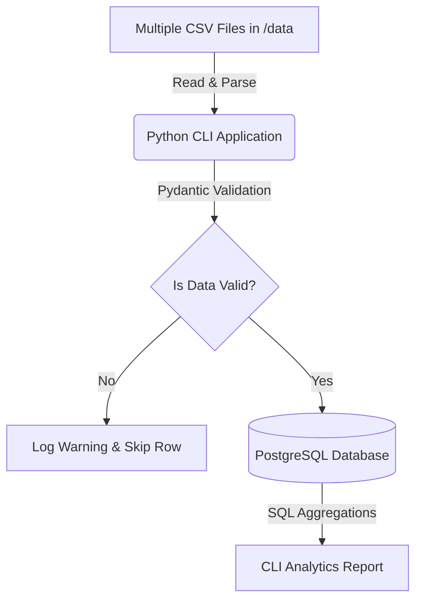

---

```markdown
# CLI Expense Tracker (Dockerized)

A CLI-based data engineering application that automates the ingestion of multiple CSV files into a PostgreSQL database. It validates data securely using Python, generates analytical reports via SQL, and runs seamlessly in a containerized Docker environment.

## Application Architecture & Data Flow

The application follows a modular architecture to ensure data integrity and a simple setup process.



**Data Flow Explanation:**

1. **Source:** The Python script automatically detects and reads all `.csv` files located in the `/data` directory.
2. **Validation:** Each row is passed through a Pydantic model (`ExpenseModel`). It enforces strict data typing (e.g., ensuring amounts are numeric and dates are standard). Invalid rows are caught via a `try-except` block, logged as warnings, and skipped without crashing the application.
3. **Storage:** Clean, validated data is ingested into a PostgreSQL database using Python database connectors.
4. **Analytics:** The CLI triggers backend SQL queries utilizing `SUM`, `AVG`, `GROUP BY`, and `ORDER BY` to generate aggregated financial reports directly in the terminal.

---

## Git Workflow Explanation

To maintain a professional development lifecycle, this project follows a strict feature-branching strategy:

* **Main Branch:** Holds the stable, production-ready codebase.
* **Feature Branches:** All new features (e.g., `feature-csv-ingestion`, `feature-docker-setup`) were developed on isolated branches.
* **Pull Requests (PR):** Once a feature was complete and tested locally, it was merged into the `main` branch exclusively via Pull Requests to maintain code quality and a clear commit history.

---

## Technology Stack

* **Core Logic:** Python 3.10
* **Data Validation:** Pydantic
* **Database:** PostgreSQL 15 (Dockerized)
* **Infrastructure:** Docker & Docker Compose
* **Environment Management:** `python-dotenv`
* **Logging:** Configurable Python `logging` module
* **Testing:** Pytest

---

## Modular Folder Structure

```text
expense-tracking/
├── app/
│   ├── main.py          # CLI entry point
│   ├── models.py        # Pydantic validation models
│   └── database.py      # PostgreSQL connection and queries
├── data/                # Folder for multiple raw CSV files
├── sql/                 # SQL schema creation scripts (init.sql)
├── tests/               # Pytest unit test files
├── .env.example         # Template for environment variables
├── docker-compose.yml   # Container orchestration
└── README.md            # Project documentation

```

---

## Setup and Run Instructions

### 1. Prerequisites

* Install Docker and Docker Compose on your machine.
* Ensure you have a `.env` file in the root directory. Copy the structure from `.env.example`:
```env
POSTGRES_USER=your_secure_user
POSTGRES_PASSWORD=your_secure_password
POSTGRES_DB=expense_db
LOG_LEVEL=INFO

```


### 2. Start the Infrastructure

Launch the PostgreSQL database and pgAdmin containers with one command:

```bash
docker-compose up -d

```

### 3. Run the CLI Application

Automated batch scripts (`.bat`) are provided to execute the Python application seamlessly inside the Docker environment:

* **Ingest Data:** Reads all CSVs from `/data`, validates, and stores them in the database.
```bash
.\start.bat ingest

```


* **View Full Analytics:** Displays total aggregated expenses and category breakdowns for all records.
```bash
.\start.bat analyze

```


* **Date-Based Analytics:** Filter the financial report by a specific month (e.g., January).
```bash
.\start.bat analyze --month January

```


* **Run Unit Tests:**
```bash
.\test.bat tests

```


---

## Sample SQL Analytics Output

When executing `.\start.bat analyze --month January`, the CLI runs grouped SQL queries to generate this formatted output:

```text
=== REPORT: JANUARY ===

1. CATEGORY BREAKDOWN:
   Category        | Total (₹)    | Avg (₹)
   ---------------------------------------------
   Food            | 3320.00      | 301.82
   Shopping        | 3300.00      | 1100.00
   Health          | 2050.00      | 683.33
   Utilities       | 2000.00      | 1000.00

 FINAL TOTAL: ₹8670.00

```

---

## Assumptions and Challenges Faced

**Assumptions:**

* The CSV files placed in the `/data` directory will consistently contain the required headers: `Date`, `Category`, `Amount`, and `Description`.
* The user running the application has basic execution permissions for shell/batch scripts.

**Challenges Faced:**

1. **Container Networking:** Connecting the Python CLI application to the PostgreSQL container required ensuring both services shared the same Docker network and using the service name (`db`) as the hostname instead of localhost.

3. **Date Formatting:** Standardizing different date string formats into PostgreSQL's `DATE` format required precise handling during the Python validation phase to ensure accurate date-based SQL filtering later.
---